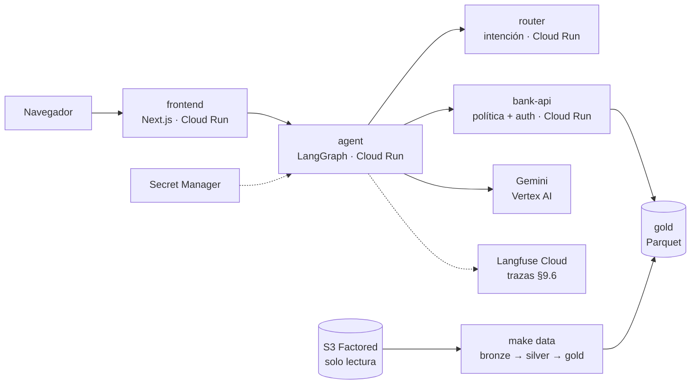

# S.O.F.I.A. — Sistema Orquestado de Filtrado e Intención Automatizada

Agente bancario **Sofía** para la recepción de disputas de transacciones, en español y portugués. Factored AI & Data Hackathon 2026.

> README de desarrollo. La versión final (rationale, arquitectura, resultados, limitaciones, camino a producción; DEL-05) la edita DS con los aportes de cada dueño.

## Workflow y alcance (REQ-01)

Un solo workflow: **recepción de disputas de transacciones** (Transaction-Dispute Intake). Sofía no resuelve la
disputa: verifica elegibilidad con la política, la **registra** en un banco simulado o la pasa a un humano con una
ficha estructurada. No mueve dinero (CON-05).

| Dentro de alcance | Fuera de alcance → abstención u oferta de humano |
|---|---|
| Consultar transacciones recientes del cliente autenticado | Mover dinero, reembolsar o reversar |
| Verificar elegibilidad con la política POL-1..7 | Resolver o aprobar la disputa (lo hace un humano) |
| Registrar la disputa tras confirmación explícita y confirmar el nº de caso | Crédito, inversiones, hipotecas |
| Consultar el estado de una disputa registrada | Datos de otros clientes |
| Escalar a humano con handoff JSON | Cambios de datos personales |

Por qué este workflow, con datos: [reporte de evaluación §2](docs/evaluation-report.md#2-workflow-y-justificación-req-01-req-02).
Política: sintética, definida por el equipo (CON-02); la aplica la capa de servicio, no el LLM
([services/src/sofia_services/policy/engine.py](services/src/sofia_services/policy/engine.py)).

## Arrancar

Solo hace falta Docker.

```bash
cp .env.example .env      # completar GEMINI_API_KEY como mínimo
make up                   # o: docker compose -f containers/local/compose.yaml --env-file .env up -d --build
```

Frontend http://localhost:3000 · agente http://localhost:8001/docs · API bancaria http://localhost:8000/docs · router http://localhost:8002/docs

Más comandos (Langfuse, pipeline, harness, Jupyter, sin make): [containers/README.md](containers/README.md).

### Datos

```bash
make data           # S3 → bronze → silver → gold; requiere AWS_ACCESS_KEY_ID, AWS_SECRET_ACCESS_KEY y S3_BUCKET en .env
make data-fixture   # mismo pipeline con datos sintéticos, sin S3 (CI y demo offline)
```

La primera corrida baja ~1.2 GB y tarda ~25 min; las siguientes son incrementales (~30 s). Detalle en [data/README.md](data/README.md).

## Demo desplegada (DEL-02)

**https://frontend-i6dmh3qssa-uc.a.run.app** · clientes demo `MX-DEMO-001`, `CO-DEMO-002`, `AR-DEMO-003`, `AR-DEMO-004` (el OTP simulado aparece en pantalla).

Escala a cero: la primera respuesta después de un rato inactiva tarda más. Para la ventana con jueces se deja una instancia caliente con `MIN_INSTANCES=1 infra/cloudrun/deploy.sh services`.

## Arquitectura de despliegue y operación (OPS)



| Pieza | Decisión | Por qué |
|---|---|---|
| Cómputo | 4 servicios en **Cloud Run**, escala a cero | Costo ≈ $0 apagado; levantable bajo pedido para los jueces (DEL-02) |
| LLM en la nube | Gemini por **Vertex AI** con la cuenta de servicio del agente | Sin API keys en la nube; lo cubren los créditos de GCP |
| Secretos | **Secret Manager** (Langfuse, Postgres); `.env` en local | CON-03: nada en el repo ni en las imágenes (`.dockerignore`, `.gcloudignore`) |
| Imágenes | Cloud Build, target `runtime` (solo el venv, usuario no root), tag = SHA de git | Reproducible y trazable a un commit |
| Datos | DuckDB + Parquet, contratos por tabla, cuarentena, lineage y freshness | REQ-12; repetible e incremental |
| Observabilidad | **Langfuse Cloud** (plan Hobby): 1 traza por conversación, 1 span por capa y por tool call | REQ-16; latencia y costo por caso para MET-05/06 |
| CI | ruff + pytest, eslint + build, gitleaks sobre todo el historial en cada PR | Ningún merge con tests rojos ni secretos |
| CD | GitHub Actions despliega en Cloud Run en cada merge a `develop`, con Workload Identity Federation | Demo siempre al día sin llaves de GCP en GitHub |
| Costos | Presupuesto con alertas al 25/50/90/100% de los créditos | Sin sorpresas de facturación |

Despliegue y operación en detalle: [infra/README.md](infra/README.md).

## Resultados (DS)

Medido offline sobre el set held-out, baseline (LLM + tools, sin capas) vs propuesto, misma carga. Detalle por idioma
y tipo de caso, con n e IC: [docs/evaluation-report.md](docs/evaluation-report.md).

| Métrica | Baseline | Propuesto |
|---|---|---|
| MET-01 Safe Automated Resolution | {{eval/outputs/ds_stats.json:baseline.metricas.met01_safe_auto_resolution}} | {{eval/outputs/ds_stats.json:proposed.metricas.met01_safe_auto_resolution}} |
| MET-02 Containment | {{eval/outputs/ds_stats.json:baseline.metricas.met02_containment}} | {{eval/outputs/ds_stats.json:proposed.metricas.met02_containment}} |
| MET-03 Recall de escalación | {{eval/outputs/ds_stats.json:baseline.metricas.met03_escalation_recall}} | {{eval/outputs/ds_stats.json:proposed.metricas.met03_escalation_recall}} |
| MET-04 Unsafe outcomes (conteo / n) | {{eval/outputs/ds_stats.json:baseline.metricas.met04_unsafe_outcomes}} | {{eval/outputs/ds_stats.json:proposed.metricas.met04_unsafe_outcomes}} |
| MET-05 Latencia p50 / p95 | {{eval/outputs/ds_stats.json:baseline.metricas.met05_latency_p50_ms}} / {{eval/outputs/ds_stats.json:baseline.metricas.met05_latency_p95_ms}} | {{eval/outputs/ds_stats.json:proposed.metricas.met05_latency_p50_ms}} / {{eval/outputs/ds_stats.json:proposed.metricas.met05_latency_p95_ms}} |
| MET-06 Costo por caso / por resolución | {{eval/outputs/ds_stats.json:baseline.metricas.met06_cost_per_case_usd}} / {{eval/outputs/ds_stats.json:baseline.metricas.met06_cost_per_safe_resolution_usd}} | {{eval/outputs/ds_stats.json:proposed.metricas.met06_cost_per_case_usd}} / {{eval/outputs/ds_stats.json:proposed.metricas.met06_cost_per_safe_resolution_usd}} |

n = {{eval/outputs/ds_stats.json:proposed.n}} casos (ES {{eval/outputs/ds_stats.json:desglose.idioma.es.n}}, PT {{eval/outputs/ds_stats.json:desglose.idioma.pt.n}}).
Router aprendido vs reglas (REQ-13): macro-F1 {{ml/reports/router_eval.json:systems.rules-ds-0.1.macro_f1}} →
{{ml/reports/router_eval.json:systems.tfidf-lr-0.1.macro_f1}}. El baseline de negocio del call center es una
**proyección**, no una mejora medida (CON-07).

## Trazabilidad REQ-01..REQ-19

Estado al 2026-10-03. "Parcial" y "pendiente" dicen qué falta.

| REQ | Estado | Evidencia |
|---|---|---|
| REQ-01 Un workflow | cumple | [Workflow y alcance](#workflow-y-alcance-req-01) · [purpose.yaml](agent/src/sofia_agent/purpose/purpose.yaml) · `test_out_of_scope_abstains_and_offers_human` en [test_paths.py](agent/tests/test_paths.py) |
| REQ-02 Justificación con datos | pendiente | Notebook `01_workflow_justification` en curso, sin merge; `02_policy_calibration` bloqueado hasta tener gold; destino: [reporte §2](docs/evaluation-report.md#2-workflow-y-justificación-req-01-req-02) |
| REQ-03 Camino automático | cumple | `test_auto_path_es_confirms_creates_and_verifies`, `test_auto_path_pt` en [test_paths.py](agent/tests/test_paths.py) · nivel 1 en [levels.py](eval/src/sofia_eval/levels.py) · [demo](#demo-desplegada-del-02) |
| REQ-04 Clarificar o abstenerse | cumple | `test_duplicate_charge_clarifies_with_cards_then_selection`, `test_two_failed_clarifications_escalate_pol7`, `test_out_of_scope_abstains_and_offers_human` en [test_paths.py](agent/tests/test_paths.py) · niveles 2 y 4 en [levels.py](eval/src/sofia_eval/levels.py) |
| REQ-05 Handoff estructurado | cumple | Contrato [handoff.py](contracts/src/sofia_contracts/handoff.py) · [orchestrate/handoff.py](agent/src/sofia_agent/orchestrate/handoff.py) · `test_high_amount_goes_to_human_with_structured_handoff` en [test_paths.py](agent/tests/test_paths.py) · consola humana [console/page.tsx](frontend/app/console/page.tsx) |
| REQ-06 ES y PT | parcial | Plantillas [es.yaml](agent/prompts/templates/es.yaml) / [pt.yaml](agent/prompts/templates/pt.yaml) · casos [es](eval/cases/es/cases.jsonl) / [pt](eval/cases/pt/cases.jsonl) · falta: métricas por idioma en el [reporte §5.1](docs/evaluation-report.md#51-por-idioma) |
| REQ-07 Contexto conversacional | cumple | `test_slots_accumulate_across_turns`, `test_asking_for_a_person_escalates_keeping_context` en [test_paths.py](agent/tests/test_paths.py) |
| REQ-08 Respuestas ancladas | cumple | Grounding y guardia de salida en [guards.py](agent/src/sofia_agent/govern/guards.py) · `test_grounding_check_rejects`, `test_hallucinated_number_falls_back_to_template` en [test_govern.py](agent/tests/test_govern.py) |
| REQ-09 Verificar acciones | cumple | Nodo `verify` en [orchestrate/nodes.py](agent/src/sofia_agent/orchestrate/nodes.py) · `test_unverified_action_is_not_claimed_and_escalates` en [test_paths.py](agent/tests/test_paths.py) · `drop_writes` en [test_bank_api.py](services/tests/test_bank_api.py) |
| REQ-10 Permisos y política fuera del prompt | cumple | [policy/engine.py](services/src/sofia_services/policy/engine.py) · [test_policy.py](services/tests/test_policy.py) · `test_malicious_llm_slots_cannot_reach_another_customer`, `test_only_act_can_create_disputes` en [test_govern.py](agent/tests/test_govern.py) · `test_injection_asking_for_other_customer_is_denied` en [test_paths.py](agent/tests/test_paths.py) |
| REQ-11 Autenticación confiable | cumple | Sesión + OTP en [auth/service.py](services/src/sofia_services/auth/service.py) · `test_auth_full_flow` en [test_bank_api.py](services/tests/test_bank_api.py) · `test_wrong_otp_is_rejected` en [test_api.py](agent/tests/test_api.py) |
| REQ-12 Pipeline de datos con contratos | cumple | [data/README.md](data/README.md) · [contracts.py](data/src/sofia_data/contracts.py), [quality.py](data/src/sofia_data/quality.py), [lineage.py](data/src/sofia_data/lineage.py) · [test_pipeline.py](data/tests/test_pipeline.py) |
| REQ-13 Componente aprendido vs baseline | pendiente | Baseline de reglas listo: [baseline_rules.py](ml/src/sofia_ml/baseline_rules.py), [test_router.py](ml/tests/test_router.py), servicio [serve.py](ml/src/sofia_ml/serve.py). La auditoría de labels muestra que el dataset no trae intenciones válidas; propuesta pendiente de aprobación: entrenar con un corpus ES/PT del equipo y split por grupo. Falta: modelo entrenado y métricas held-out, sin merge; [reporte §6](docs/evaluation-report.md#6-router-aprendido-vs-baseline-de-reglas-req-13) |
| REQ-14 Held-out vs baseline | parcial | Harness [run.py](eval/src/sofia_eval/run.py) + [metrics.py](eval/src/sofia_eval/metrics.py) · baseline [baseline/agent.py](agent/src/sofia_agent/baseline/agent.py) · falta: corrida completa, n e IC en el [reporte §5](docs/evaluation-report.md#5-resultados-medido-offline) |
| REQ-15 Casos adversos | parcial | Niveles 4 y 5 en [levels.py](eval/src/sofia_eval/levels.py) · `test_expired_session_requests_reauth`, `test_tool_down_after_retries_escalates`, `test_foreign_transaction_id_is_denied_without_revealing_pol1` en [test_paths.py](agent/tests/test_paths.py) · falta en el harness: mezcla ES/PT y datos incorrectos |
| REQ-16 Ruta a operación | cumple | Tracing [tracing.py](agent/src/sofia_agent/tracing.py) + [test_tracing.py](agent/tests/test_tracing.py) · reintentos y fallback [test_llm_chain.py](agent/tests/test_llm_chain.py), `test_retry_is_idempotent` · auditoría [audit/logger.py](services/src/sofia_services/audit/logger.py) · [infra/README.md](infra/README.md) |
| REQ-17 Honestidad sobre lo que falta | parcial | [Limitaciones infra y datos](#limitaciones-y-camino-a-producción-infra-y-datos) · [agente, ML y evaluación](#limitaciones-y-camino-a-producción-agente-ml-y-evaluación) · [reporte §10](docs/evaluation-report.md#10-limitaciones) · falta: cerrar con los resultados |
| REQ-18 Fairness | pendiente | Notebook `05_fairness` en curso, sin merge; destino: [reporte §7](docs/evaluation-report.md#7-fairness-req-18) |
| REQ-19 Explicaciones auditables | cumple | Eventos por capa [trail.py](agent/src/sofia_agent/govern/trail.py) / [events.py](contracts/src/sofia_contracts/events.py) · auditoría [audit/logger.py](services/src/sofia_services/audit/logger.py) · motivo con la regla en `test_declined_transaction_is_not_disputable_pol2`, `test_old_transaction_denied_pol3_offers_human` en [test_paths.py](agent/tests/test_paths.py) |

## Limitaciones y camino a producción (infra y datos)

| Hoy (hackathon) | En producción |
|---|---|
| Conversaciones del agente en memoria (sin Postgres en la nube) → 1 instancia y se pierden al escalar a cero | Postgres administrado (Neon / Cloud SQL) como checkpointer; varias instancias |
| bank-api en la nube con log de auditoría en memoria y solo los clientes demo (gold no viaja en la imagen) | bank-api con su base y log de auditoría persistente, gold servido desde GCS / BigQuery |
| `/admin/*` y `/session/test` de bank-api protegidas en la nube con una clave compartida (`X-Admin-Key`) | Fuera del despliegue público, detrás de IAM |
| bank-api con estado en memoria → 1 instancia | Estado en Postgres; varias instancias |
| Spans de bank-api y router no se unen a la traza del agente | Propagación `traceparent` + OpenTelemetry en todos los servicios |
| Servicios públicos (`--allow-unauthenticated`); la identidad la valida la sesión con OTP | router y bank-api internos (VPC / IAM invoker); solo el frontend expuesto |
| Gold se regenera a mano con `make data` | Pipeline programado (Cloud Run Jobs / Composer) con alertas de calidad y freshness |
| Dataset estático (termina el 2026-06-17); freshness solo se reporta | SLA de freshness que bloquea la publicación de gold si se incumple |
| Labels de intención provisionales en `gold_intent_training` | Mapeo de DS versionado + etiquetado humano |
| Langfuse Hobby: 50k unidades/mes, 30 días de retención | Plan pago o self-hosted, con retención según política del banco |
| CD a un solo entorno: cada merge a `develop` despliega la demo | Entornos staging / prod separados, con promoción y rollback |

## Limitaciones y camino a producción (agente, ML y evaluación)

| Hoy (hackathon) | En producción |
|---|---|
| El dataset no trae labels de intención válidos (`customer_text` = 42 plantillas de consulta de saldo; `detected_intents` = `consulta_general`). Propuesta pendiente: router entrenado con un corpus ES/PT del equipo (CON-02) | Etiquetado humano de conversaciones reales, con acuerdo entre anotadores medido y versionado |
| Router v0 sirve reglas por palabras clave | Modelo entrenado que gane al baseline en held-out, con umbral de confianza calibrado y monitoreo de drift |
| Todo el portugués es texto generado por el equipo (traducción + revisión) | Corpus y casos PT reales; evaluación por idioma con texto nativo |
| N, U y umbral de fraude con valores por defecto: la calibración está bloqueada hasta tener gold | Política calibrada con datos y aprobada por riesgo/legal; cambios versionados |
| Set held-out chico, que comparte clientes de prueba y comercios con el set de desarrollo | 200–300+ escenarios separados por cliente, más muestra de tráfico real etiquetada |
| Puntuación determinística sobre la ruta final; evaluadores de Langfuse sin validar contra humano | Evaluadores validados (acuerdo con humano reportado) y revisión humana periódica |
| Costo MET-06 = tokens × precio público declarado | Costo real de facturación por caso |
| Baseline de negocio = proyección sobre el histórico sintético (CON-07) | Prueba A/B o piloto con clientes reales antes de afirmar mejoras |
| Fairness solo por idioma y segmento sobre pocos clientes de prueba | Monitoreo continuo por idioma, país y segmento con alertas de disparidad |

Checklist de entrega: [DEFINITION_OF_DONE.md](DEFINITION_OF_DONE.md).

## Estructura y dueños

| Carpeta | Dueño | Qué va |
|---|---|---|
| [contracts/](contracts/) | Todos | Contratos Pydantic de §9 + JSON Schema exportado. Se cambian solo con aviso |
| [data/](data/) | OPS | Pipeline S3 → bronze → silver → gold, calidad, lineage, freshness |
| [infra/](infra/) | OPS | Cloud Run, Secret Manager, configuración de Langfuse en la nube |
| [containers/](containers/) | OPS | Dockerfiles y compose local |
| [analysis/](analysis/) | DS | EDA, justificación del workflow, baseline de negocio, calibración de N y U |
| [ml/](ml/) | DS | Router de intención: labels, entrenamiento, evaluación, servicio |
| [services/](services/) | SIM | API bancaria simulada: auth, permisos, política POL-1..7, auditoría, fallas |
| [eval/](eval/) | SIM + DS | Simulador, harness baseline vs propuesto, métricas MET-01..06, reporte |
| [agent/](agent/) | AG | Grafo LangGraph de 7 capas, Gemini, handoff, baseline de sistema |
| [frontend/](frontend/) | AG | Chat ES/PT, caja de cristal, consola del agente humano |
| [docs/](docs/) | DS | Reporte de evaluación, slides, guion del video |

Python: un **workspace de uv** (`pyproject.toml` en la raíz + uno por carpeta, un solo `uv.lock`). Los paquetes se importan como `sofia_contracts`, `sofia_agent`, etc.

## Reglas

- **Nada de secretos ni registros de clientes en el repo** (CON-03). Van en `.env`, que está en `.gitignore`.
- Una carpeta, un dueño; los cambios cruzados van por PR aprobado por el dueño.
- Ramas cortas desde `develop` (`feat/...`) y PRs chicos.
