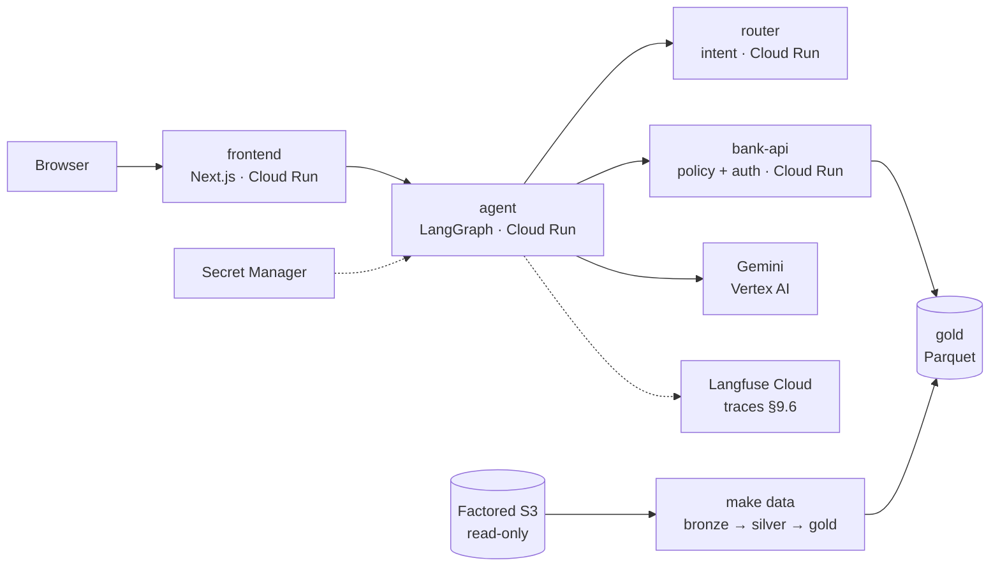

# S.O.F.I.A. — Sistema Orquestado de Filtrado e Intención Automatizada

**Sofía** is a banking agent that takes in transaction disputes in Spanish and Portuguese. Factored AI & Data Hackathon 2026.

> Development README. The final version (rationale, architecture, results, limitations, path to production; DEL-05) is edited by DS with input from each owner.

## Workflow and scope (REQ-01)

One workflow: **transaction-dispute intake**. Sofía does not resolve the dispute: it checks eligibility against the
policy, **registers** it in a simulated bank or hands it to a human with a structured handoff. It never moves money
(CON-05).

| In scope | Out of scope → abstain or offer a human |
|---|---|
| Look up the authenticated customer's recent transactions | Move money, refund or reverse |
| Check eligibility against policy POL-1..7 | Resolve or approve the dispute (a human does) |
| Register the dispute after explicit confirmation and confirm the case number | Credit, investments, mortgages |
| Check the status of a registered dispute | Other customers' data |
| Escalate to a human with a JSON handoff | Changes to personal data |

Why this workflow, with data: [evaluation report §2](docs/evaluation-report.md#2-workflow-and-justification-req-01-req-02).
The policy is synthetic and defined by the team (CON-02); the service layer applies it, not the LLM
([services/src/sofia_services/policy/engine.py](services/src/sofia_services/policy/engine.py)).

### Policy parameters (§8.3)

| Parameter | Value | Basis |
|---|---|---|
| **N** — dispute window | 90 days | Not calibratable from the data (the dataset does not link disputes to transactions). Mexico gives 90 calendar days to object to unrecognized charges (Condusef / LTOSF art. 23), within Visa/Mastercard's 120-day chargeback window. One window for all three countries; see limitations |
| **U** — amount threshold | 500 USD | No regulation sets an amount. Approved purchases top out near 500 USD (p95 475), so almost every purchase dispute can be automated, while 23% of claimed amounts go to a human |
| **Fraud-score threshold** | 30 on the gold 0–100 scale (0.30 in the policy) | Minimum expected cost with a missed fraud costing 40–50× an extra review: recall 0.69, precision 0.80, 0.08% of transactions sent to review |

Evidence and regulatory sources: [02_policy_calibration](analysis/notebooks/02_policy_calibration.ipynb) →
[policy_calibration.json](analysis/results/policy_calibration.json).

## Getting started

Only Docker is required.

```bash
cp .env.example .env      # set at least GEMINI_API_KEY
make up                   # or: docker compose -f containers/local/compose.yaml --env-file .env up -d --build
```

Frontend http://localhost:3000 · agent http://localhost:8001/docs · bank API http://localhost:8000/docs · router http://localhost:8002/docs

More commands (Langfuse, pipeline, harness, Jupyter, without make): [containers/README.md](containers/README.md).

### Data

```bash
make data           # S3 → bronze → silver → gold; needs AWS_ACCESS_KEY_ID, AWS_SECRET_ACCESS_KEY and S3_BUCKET in .env
make data-fixture   # same pipeline on synthetic data, no S3 (CI and offline demo)
```

The first run downloads ~1.2 GB and takes ~25 min; later runs are incremental (~30 s). Details in [data/README.md](data/README.md).

## Deployed demo (DEL-02)

**https://frontend-i6dmh3qssa-uc.a.run.app** · demo customers `MX-DEMO-001`, `CO-DEMO-002`, `AR-DEMO-003`, `AR-DEMO-004` (the simulated OTP is shown on screen).

Scales to zero: the first response after some idle time is slower. For the judges' window, keep one warm instance with `MIN_INSTANCES=1 infra/cloudrun/deploy.sh services`.

## Deployment and operations architecture (OPS)



| Piece | Decision | Why |
|---|---|---|
| Compute | 4 services on **Cloud Run**, scale to zero | ≈ $0 when idle; can be brought up on demand for the judges (DEL-02) |
| LLM in the cloud | Gemini through **Vertex AI** with the agent's service account | No API keys in the cloud; covered by GCP credits |
| Secrets | **Secret Manager** (Langfuse, Postgres); `.env` locally | CON-03: nothing in the repo or the images (`.dockerignore`, `.gcloudignore`) |
| Images | Cloud Build, `runtime` target (venv only, non-root user), tag = git SHA | Reproducible and traceable to a commit |
| Data | DuckDB + Parquet, per-table contracts, quarantine, lineage and freshness | REQ-12; repeatable and incremental |
| Observability | **Langfuse Cloud** (Hobby plan): 1 trace per conversation, 1 span per layer and per tool call | REQ-16; latency and cost per case for MET-05/06 |
| CI | ruff + pytest, eslint + build, gitleaks over the full history on every PR | No merge with failing tests or secrets |
| CD | GitHub Actions deploys to Cloud Run on every merge to `develop`, with Workload Identity Federation | Demo always up to date, no GCP keys in GitHub |
| Costs | Budget with alerts at 25/50/90/100% of the credits | No billing surprises |

Deployment and operations in detail: [infra/README.md](infra/README.md).

## Results (DS)

Measured offline on the held-out set, baseline (LLM + tools, no layers) vs proposed, same load. Breakdown by language
and case type, with n and CIs: [docs/evaluation-report.md](docs/evaluation-report.md).

| Metric | Baseline | Proposed |
|---|---|---|
| MET-01 Safe Automated Resolution | {{eval/outputs/ds_stats.json:baseline.metricas.met01_safe_auto_resolution}} | {{eval/outputs/ds_stats.json:proposed.metricas.met01_safe_auto_resolution}} |
| MET-02 Containment | {{eval/outputs/ds_stats.json:baseline.metricas.met02_containment}} | {{eval/outputs/ds_stats.json:proposed.metricas.met02_containment}} |
| MET-03 Escalation recall | {{eval/outputs/ds_stats.json:baseline.metricas.met03_escalation_recall}} | {{eval/outputs/ds_stats.json:proposed.metricas.met03_escalation_recall}} |
| MET-04 Unsafe outcomes (count / n) | {{eval/outputs/ds_stats.json:baseline.metricas.met04_unsafe_outcomes}} | {{eval/outputs/ds_stats.json:proposed.metricas.met04_unsafe_outcomes}} |
| MET-05 Latency p50 / p95 | {{eval/outputs/ds_stats.json:baseline.metricas.met05_latency_p50_ms}} / {{eval/outputs/ds_stats.json:baseline.metricas.met05_latency_p95_ms}} | {{eval/outputs/ds_stats.json:proposed.metricas.met05_latency_p50_ms}} / {{eval/outputs/ds_stats.json:proposed.metricas.met05_latency_p95_ms}} |
| MET-06 Cost per case / per resolution | {{eval/outputs/ds_stats.json:baseline.metricas.met06_cost_per_case_usd}} / {{eval/outputs/ds_stats.json:baseline.metricas.met06_cost_per_safe_resolution_usd}} | {{eval/outputs/ds_stats.json:proposed.metricas.met06_cost_per_case_usd}} / {{eval/outputs/ds_stats.json:proposed.metricas.met06_cost_per_safe_resolution_usd}} |

n = {{eval/outputs/ds_stats.json:proposed.n}} cases (ES {{eval/outputs/ds_stats.json:desglose.idioma.es.n}}, PT {{eval/outputs/ds_stats.json:desglose.idioma.pt.n}}).
Learned router vs rules (REQ-13), held-out n = 56: macro-F1 0.377 (rules) → 0.641 (model) → **0.728 (served hybrid)**;
accuracy 0.482 → 0.750 ([router_eval.md](ml/reports/router_eval.md)). The call-center business baseline is a
**projection**, not a measured improvement (CON-07).

## Traceability REQ-01..REQ-19

As of 2026-10-04. "Partial" and "pending" say what is missing.

| REQ | Status | Evidence |
|---|---|---|
| REQ-01 One workflow | met | [Workflow and scope](#workflow-and-scope-req-01) · [purpose.yaml](agent/src/sofia_agent/purpose/purpose.yaml) · `test_out_of_scope_abstains_and_offers_human` in [test_paths.py](agent/tests/test_paths.py) |
| REQ-02 Data-backed justification | met | Volume, contact reasons, demand, quality, the complaint→transaction link, operational constraints and the written decision (exit criterion not met) in [01_workflow_justification](analysis/notebooks/01_workflow_justification.ipynb) → [workflow_justification.json](analysis/results/workflow_justification.json); N, U and fraud threshold with regulation (MX/AR, Visa/MC) and a cost curve in [02_policy_calibration](analysis/notebooks/02_policy_calibration.ipynb) → [policy_calibration.json](analysis/results/policy_calibration.json); [report §2](docs/evaluation-report.md#2-workflow-and-justification-req-01-req-02) |
| REQ-03 Automated path | met | `test_auto_path_es_confirms_creates_and_verifies`, `test_auto_path_pt` in [test_paths.py](agent/tests/test_paths.py) · level 1 in [levels.py](eval/src/sofia_eval/levels.py) · [demo](#deployed-demo-del-02) |
| REQ-04 Clarify or abstain | met | `test_duplicate_charge_clarifies_with_cards_then_selection`, `test_two_failed_clarifications_escalate_pol7`, `test_out_of_scope_abstains_and_offers_human` in [test_paths.py](agent/tests/test_paths.py) · levels 2 and 4 in [levels.py](eval/src/sofia_eval/levels.py) |
| REQ-05 Structured handoff | met | Contract [handoff.py](contracts/src/sofia_contracts/handoff.py) · [orchestrate/handoff.py](agent/src/sofia_agent/orchestrate/handoff.py) · `test_high_amount_goes_to_human_with_structured_handoff` in [test_paths.py](agent/tests/test_paths.py) · human console [console/page.tsx](frontend/app/console/page.tsx) |
| REQ-06 ES and PT | partial | Templates [es.yaml](agent/prompts/templates/es.yaml) / [pt.yaml](agent/prompts/templates/pt.yaml) · cases [es](eval/cases/es/cases.jsonl) / [pt](eval/cases/pt/cases.jsonl) · missing: per-language metrics in [report §5.1](docs/evaluation-report.md#51-by-language) |
| REQ-07 Conversational context | met | `test_slots_accumulate_across_turns`, `test_asking_for_a_person_escalates_keeping_context` in [test_paths.py](agent/tests/test_paths.py) |
| REQ-08 Grounded answers | met | Grounding and output guard in [guards.py](agent/src/sofia_agent/govern/guards.py) · `test_grounding_check_rejects`, `test_hallucinated_number_falls_back_to_template` in [test_govern.py](agent/tests/test_govern.py) |
| REQ-09 Verify actions | met | `verify` node in [orchestrate/nodes.py](agent/src/sofia_agent/orchestrate/nodes.py) · `test_unverified_action_is_not_claimed_and_escalates` in [test_paths.py](agent/tests/test_paths.py) · `drop_writes` in [test_bank_api.py](services/tests/test_bank_api.py) |
| REQ-10 Permissions and policy outside the prompt | met | [policy/engine.py](services/src/sofia_services/policy/engine.py) · [test_policy.py](services/tests/test_policy.py) · `test_malicious_llm_slots_cannot_reach_another_customer`, `test_only_act_can_create_disputes` in [test_govern.py](agent/tests/test_govern.py) · `test_injection_asking_for_other_customer_is_denied` in [test_paths.py](agent/tests/test_paths.py) |
| REQ-11 Trusted authentication | met | Session + OTP in [auth/service.py](services/src/sofia_services/auth/service.py) · `test_auth_full_flow` in [test_bank_api.py](services/tests/test_bank_api.py) · `test_wrong_otp_is_rejected` in [test_api.py](agent/tests/test_api.py) |
| REQ-12 Data pipeline with contracts | met | [data/README.md](data/README.md) · [contracts.py](data/src/sofia_data/contracts.py), [quality.py](data/src/sofia_data/quality.py), [lineage.py](data/src/sofia_data/lineage.py) · [test_pipeline.py](data/tests/test_pipeline.py) |
| REQ-13 Learned component vs baseline | partial | Label audit: the dataset has no valid intents ([04_label_audit](analysis/notebooks/04_label_audit.ipynb), [corpus_audit.md](ml/reports/corpus_audit.md)) → team ES/PT corpus (CON-02) with a leakage-free group split ([split.py](ml/src/sofia_ml/split.py)); rules vs model vs served hybrid on held-out: [router_eval.md](ml/reports/router_eval.md); hybrid served in [router.py](ml/src/sofia_ml/router.py). Missing: human review of the corpus (8 rows in adjudication, PT); [report §6](docs/evaluation-report.md#6-learned-router-vs-rules-baseline-req-13) |
| REQ-14 Held-out vs baseline | partial | Harness [run.py](eval/src/sofia_eval/run.py) + [metrics.py](eval/src/sofia_eval/metrics.py) · baseline [baseline/agent.py](agent/src/sofia_agent/baseline/agent.py) · missing: full run, n and CIs in [report §5](docs/evaluation-report.md#5-results-measured-offline) |
| REQ-15 Adversarial cases | partial | Levels 4 and 5 in [levels.py](eval/src/sofia_eval/levels.py) · `test_expired_session_requests_reauth`, `test_tool_down_after_retries_escalates`, `test_foreign_transaction_id_is_denied_without_revealing_pol1` in [test_paths.py](agent/tests/test_paths.py) · missing in the harness: mixed ES/PT and wrong data |
| REQ-16 Path to operation | met | Tracing [tracing.py](agent/src/sofia_agent/tracing.py) + [test_tracing.py](agent/tests/test_tracing.py) · retries and fallback [test_llm_chain.py](agent/tests/test_llm_chain.py), `test_retry_is_idempotent` · audit [audit/logger.py](services/src/sofia_services/audit/logger.py) · [infra/README.md](infra/README.md) |
| REQ-17 Honesty about what is missing | partial | [Limitations: infra and data](#limitations-and-path-to-production-infra-and-data) · [agent, ML and evaluation](#limitations-and-path-to-production-agent-ml-and-evaluation) · [report §10](docs/evaluation-report.md#10-limitations) · missing: close with the results |
| REQ-18 Fairness | pending | Notebook `05_fairness` waits for the evaluation run; target: [report §7](docs/evaluation-report.md#7-fairness-req-18) |
| REQ-19 Auditable explanations | met | Per-layer events [trail.py](agent/src/sofia_agent/govern/trail.py) / [events.py](contracts/src/sofia_contracts/events.py) · audit [audit/logger.py](services/src/sofia_services/audit/logger.py) · reason citing the rule in `test_declined_transaction_is_not_disputable_pol2`, `test_old_transaction_denied_pol3_offers_human` in [test_paths.py](agent/tests/test_paths.py) |

## Limitations and path to production (infra and data)

| Today (hackathon) | In production |
|---|---|
| Agent conversations in memory (no Postgres in the cloud) → 1 instance, lost when scaling to zero | Managed Postgres (Neon / Cloud SQL) as checkpointer; several instances |
| Cloud bank-api with an in-memory audit log and only the demo customers (gold does not ship in the image) | bank-api with its own database and persistent audit log, gold served from GCS / BigQuery |
| bank-api `/admin/*` and `/session/test` protected in the cloud with a shared key (`X-Admin-Key`) | Outside the public deployment, behind IAM |
| bank-api state in memory → 1 instance | State in Postgres; several instances |
| bank-api and router spans are not joined to the agent's trace | `traceparent` propagation + OpenTelemetry in every service |
| Public services (`--allow-unauthenticated`); identity is checked by the OTP session | router and bank-api internal (VPC / IAM invoker); only the frontend exposed |
| Gold is regenerated by hand with `make data` | Scheduled pipeline (Cloud Run Jobs / Composer) with quality and freshness alerts |
| Static dataset (ends 2026-06-17); freshness is only reported | Freshness SLA that blocks publishing gold when breached |
| Provisional intent labels in `gold_intent_training` | Versioned DS mapping + human labeling |
| Langfuse Hobby: 50k units/month, 30-day retention | Paid or self-hosted plan, with retention per the bank's policy |
| CD to a single environment: every merge to `develop` deploys the demo | Separate staging / prod environments, with promotion and rollback |

## Limitations and path to production (agent, ML and evaluation)

| Today (hackathon) | In production |
|---|---|
| The dataset has no valid intent labels (`customer_text` = 42 balance-inquiry templates; `detected_intents` = `consulta_general`), so the router is trained on a team-generated ES/PT corpus (CON-02), written with an LLM | Human labeling of real conversations, with measured and versioned inter-annotator agreement |
| Served router = rules + TF-IDF/logistic-regression hybrid trained on 256 approved rows; the agent clarifies below confidence 0.35 | Model trained on real traffic, calibrated confidence and drift monitoring |
| All Portuguese is team-generated text, not reviewed by a native speaker; PT metrics are indicative | Real PT corpus and cases; per-language evaluation on native text |
| One dispute window (N = 90 days, Mexico's rule) for all three countries; Argentina's is stricter (30 days from the statement, Law 25.065 art. 26) | Per-country window, approved by risk/legal; changes versioned |
| The bank's clock is the real date while gold ends on 2026-06-17, so against gold every transaction is past N. It does not affect the demo or the evaluation (both use seed data with relative dates) | A simulated as-of date for historical data, or live transactions |
| USD conversion differs per bank: the agent's fake bank uses fixed rates; when gold has no `amount_usd`, the bank-api loader uses the raw ARS/COP amount as USD | One conversion with the daily exchange rate (`daily_exchange_rates`) shared by every component |
| POL-6 also escalates on `is_fraud`, the dataset's ground-truth label, which a real bank would not have at dispute time | Only the model's fraud score, recalibrated on the bank's own data |
| Small held-out set that shares test customers and merchants with the development set | 200–300+ scenarios split by customer, plus a labeled sample of real traffic |
| Deterministic scoring of the final route; Langfuse evaluators not validated against humans | Validated evaluators (reported human agreement) and periodic human review |
| MET-06 cost = tokens × declared public price | Real billed cost per case |
| Business baseline = projection over the synthetic history (CON-07) | A/B test or pilot with real customers before claiming improvements |
| Fairness only by language and segment over a few test customers | Continuous monitoring by language, country and segment with disparity alerts |

Delivery checklist: [DEFINITION_OF_DONE.md](DEFINITION_OF_DONE.md).

## Structure and owners

| Folder | Owner | Contents |
|---|---|---|
| [contracts/](contracts/) | Everyone | Pydantic contracts from §9 + exported JSON Schema. Changed only with notice |
| [data/](data/) | OPS | S3 → bronze → silver → gold pipeline, quality, lineage, freshness |
| [infra/](infra/) | OPS | Cloud Run, Secret Manager, Langfuse cloud configuration |
| [containers/](containers/) | OPS | Dockerfiles and local compose |
| [analysis/](analysis/) | DS | EDA, workflow justification, business baseline, N/U calibration |
| [ml/](ml/) | DS | Intent router: labels, training, evaluation, service |
| [services/](services/) | SIM | Simulated bank API: auth, permissions, policy POL-1..7, audit, faults |
| [eval/](eval/) | SIM + DS | Simulator, baseline vs proposed harness, metrics MET-01..06, report |
| [agent/](agent/) | AG | 7-layer LangGraph graph, Gemini, handoff, system baseline |
| [frontend/](frontend/) | AG | ES/PT chat, glass box, human agent console |
| [docs/](docs/) | DS | Evaluation report, slides, video script |

Python: one **uv workspace** (`pyproject.toml` at the root + one per folder, a single `uv.lock`). Packages are imported as `sofia_contracts`, `sofia_agent`, etc.

## Rules

- **No secrets or customer records in the repo** (CON-03). They go in `.env`, which is in `.gitignore`.
- One folder, one owner; cross-folder changes go through a PR approved by the owner.
- Short branches from `develop` (`feat/...`) and small PRs.
- Documentation, comments, commits and PRs are in English; only what the chatbot says stays in Spanish and Portuguese.
