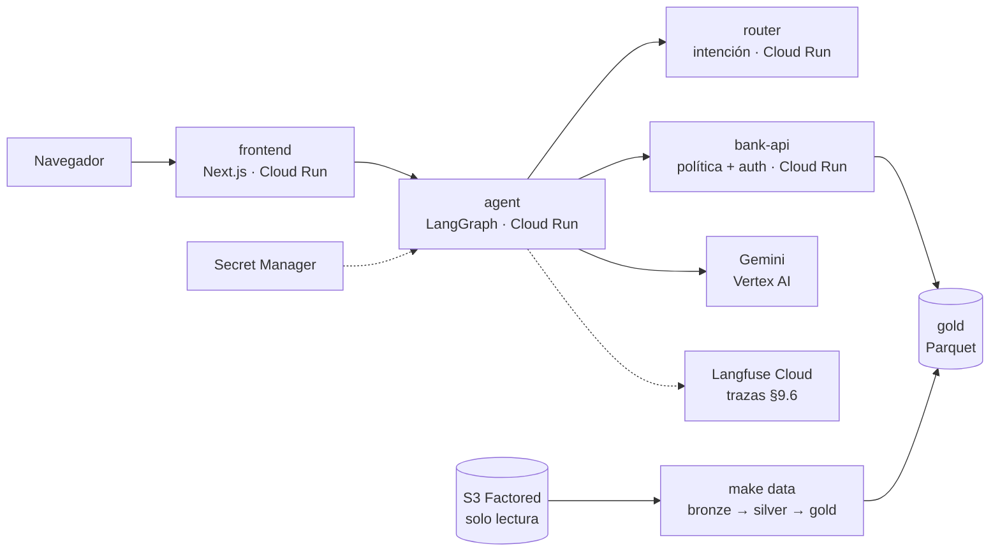

# S.O.F.I.A. — Sistema Orquestado de Filtrado e Intención Automatizada

Agente bancario **Sofía** para la recepción de disputas de transacciones, en español y portugués. Factored AI & Data Hackathon 2026.

> README de desarrollo. La versión final (rationale, arquitectura, resultados, limitaciones, camino a producción; DEL-05) la edita DS con los aportes de cada dueño.

## Arrancar

Solo hace falta Docker.

```bash
cp .env.example .env      # completar GEMINI_API_KEY como mínimo
make up                   # o: docker compose -f containers/local/compose.yaml --env-file .env up -d --build
```

Frontend http://localhost:3000 · agente http://localhost:8001/docs · API bancaria http://localhost:8000/docs · router http://localhost:8002/docs

Más comandos (Langfuse, pipeline, harness, Jupyter, sin make): [containers/README.md](containers/README.md).

### Datos

```bash
make data           # S3 → bronze → silver → gold; requiere AWS_ACCESS_KEY_ID, AWS_SECRET_ACCESS_KEY y S3_BUCKET en .env
make data-fixture   # mismo pipeline con datos sintéticos, sin S3 (CI y demo offline)
```

La primera corrida baja ~1.2 GB y tarda ~25 min; las siguientes son incrementales (~30 s). Detalle en [data/README.md](data/README.md).

## Demo desplegada (DEL-02)

**https://frontend-i6dmh3qssa-uc.a.run.app** · clientes demo `MX-DEMO-001`, `CO-DEMO-002`, `AR-DEMO-003`, `AR-DEMO-004` (el OTP simulado aparece en pantalla).

Escala a cero: la primera respuesta después de un rato inactiva tarda más. Para la ventana con jueces se deja una instancia caliente con `MIN_INSTANCES=1 infra/cloudrun/deploy.sh services`.

## Arquitectura de despliegue y operación (OPS)



| Pieza | Decisión | Por qué |
|---|---|---|
| Cómputo | 4 servicios en **Cloud Run**, escala a cero | Costo ≈ $0 apagado; levantable bajo pedido para los jueces (DEL-02) |
| LLM en la nube | Gemini por **Vertex AI** con la cuenta de servicio del agente | Sin API keys en la nube; lo cubren los créditos de GCP |
| Secretos | **Secret Manager** (Langfuse, Postgres); `.env` en local | CON-03: nada en el repo ni en las imágenes (`.dockerignore`, `.gcloudignore`) |
| Imágenes | Cloud Build, target `runtime` (solo el venv, usuario no root), tag = SHA de git | Reproducible y trazable a un commit |
| Datos | DuckDB + Parquet, contratos por tabla, cuarentena, lineage y freshness | REQ-12; repetible e incremental |
| Observabilidad | **Langfuse Cloud** (plan Hobby): 1 traza por conversación, 1 span por capa y por tool call | REQ-16; latencia y costo por caso para MET-05/06 |
| CI | ruff + pytest, eslint + build, gitleaks sobre todo el historial en cada PR | Ningún merge con tests rojos ni secretos |
| Costos | Presupuesto con alertas al 25/50/90/100% de los créditos | Sin sorpresas de facturación |

Despliegue y operación en detalle: [infra/README.md](infra/README.md).

## Limitaciones y camino a producción (infra y datos)

| Hoy (hackathon) | En producción |
|---|---|
| Conversaciones del agente en memoria (sin Postgres en la nube) → 1 instancia y se pierden al escalar a cero | Postgres administrado (Neon / Cloud SQL) como checkpointer; varias instancias |
| El agente usa el banco simulado en proceso hasta integrar bank-api | bank-api real con su base y log de auditoría persistente |
| Servicios públicos (`--allow-unauthenticated`); la identidad la valida la sesión con OTP | router y bank-api internos (VPC / IAM invoker); solo el frontend expuesto |
| Gold se regenera a mano con `make data` | Pipeline programado (Cloud Run Jobs / Composer) con alertas de calidad y freshness |
| Dataset estático (termina el 2026-06-17); freshness solo se reporta | SLA de freshness que bloquea la publicación de gold si se incumple |
| Labels de intención provisionales en `gold_intent_training` | Mapeo de DS versionado + etiquetado humano |
| Langfuse Hobby: 50k unidades/mes, 30 días de retención | Plan pago o self-hosted, con retención según política del banco |
| Deploy con `deploy.sh` manual | Deploy desde CI al mergear a `main`, con entornos staging / prod |

Checklist de entrega: [DEFINITION_OF_DONE.md](DEFINITION_OF_DONE.md).

## Estructura y dueños

| Carpeta | Dueño | Qué va |
|---|---|---|
| [contracts/](contracts/) | Todos | Contratos Pydantic de §9 + JSON Schema exportado. Se cambian solo con aviso |
| [data/](data/) | OPS | Pipeline S3 → bronze → silver → gold, calidad, lineage, freshness |
| [infra/](infra/) | OPS | Cloud Run, Secret Manager, configuración de Langfuse en la nube |
| [containers/](containers/) | OPS | Dockerfiles y compose local |
| [analysis/](analysis/) | DS | EDA, justificación del workflow, baseline de negocio, calibración de N y U |
| [ml/](ml/) | DS | Router de intención: labels, entrenamiento, evaluación, servicio |
| [services/](services/) | SIM | API bancaria simulada: auth, permisos, política POL-1..7, auditoría, fallas |
| [eval/](eval/) | SIM + DS | Simulador, harness baseline vs propuesto, métricas MET-01..06, reporte |
| [agent/](agent/) | AG | Grafo LangGraph de 7 capas, Gemini, handoff, baseline de sistema |
| [frontend/](frontend/) | AG | Chat ES/PT, caja de cristal, consola del agente humano |
| [docs/](docs/) | DS | Reporte de evaluación, slides, guion del video |

Python: un **workspace de uv** (`pyproject.toml` en la raíz + uno por carpeta, un solo `uv.lock`). Los paquetes se importan como `sofia_contracts`, `sofia_agent`, etc.

## Reglas

- **Nada de secretos ni registros de clientes en el repo** (CON-03). Van en `.env`, que está en `.gitignore`.
- Una carpeta, un dueño; los cambios cruzados van por PR aprobado por el dueño.
- Ramas cortas desde `develop` (`feat/...`) y PRs chicos.
